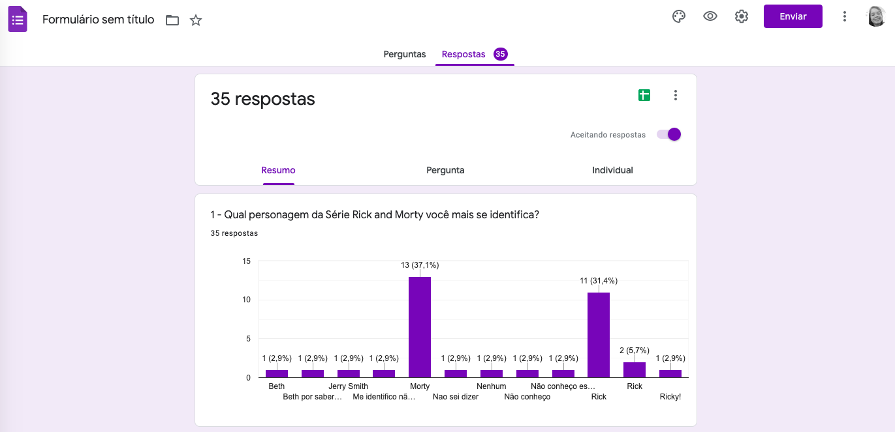
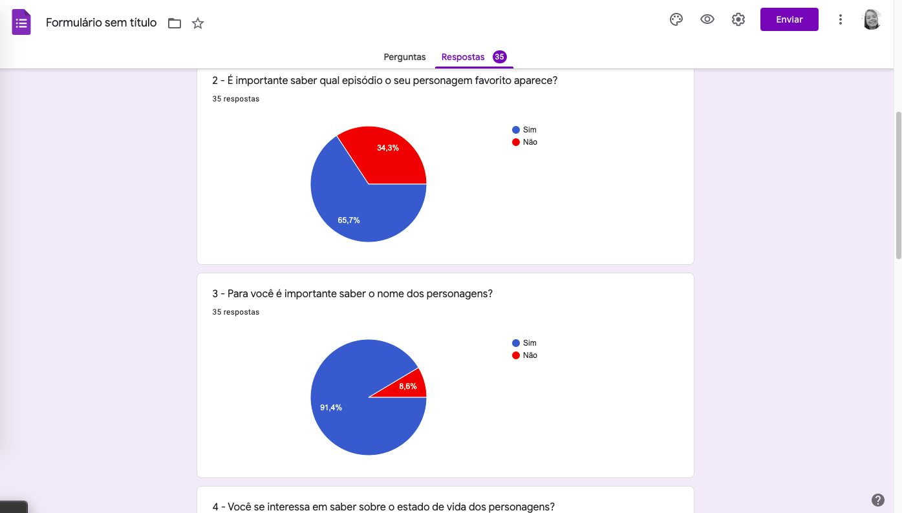
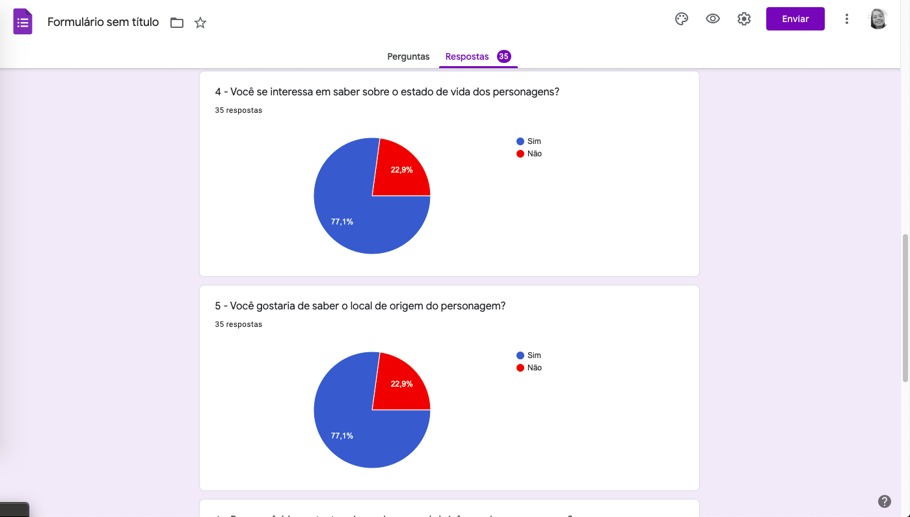
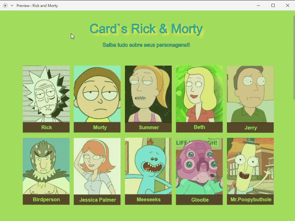

# Rick and Morty

## Índice

- [1. Sobre](#1-sobre)
- [2. Resumo do projeto](#2-resumo-do-projeto)
- [3. Experiência do Usuário](#3-experiência-do-usuário)
- [4. Protótipo de Baixa Fidelidade](#5-protótipo-de-baixa-fidelidade)
- [5. Objetivos de aprendizagem](#6-objetivos-de-aprendizagem)
- [6. Autoria](#6-autoria)

---

## 1. Sobre

Rick and Morty (em português Rick e Morty) é uma série de animação adulta norte-americana de comédia e ficção científica criada por Justin Roiland e Dan Harmon para o bloco de programação noturno Adult Swim,exibido no canal Cartoon Network.
A série se originou de uma paródia animada em curta-metragem do filme "De Volta Para o Futuro" criada por Roiland para o festival de cinema Channel 101. A Adult Swim abordou Harmon a respeito de ideias para um programa de televisão, então ele e Roiland desenvolveram o programa com base no curta, substituindo os personagens de Doc com Rick e Marty com Morty.

## 2. Resumo do projeto

Projeto Data Lovers realizado no bootcamp da Laboratória (_SAP006_) idealizado para os fãs e curiosos da série Rick And Morty. É uma aplicação web que possibilita obter informações através sobre a série através de um menu de filtros dos personagens onde é possível escolher opções como: Gênero, Espécie, Status, Ordem Alfabética ou por pesquisa de nome.

## 3. Experiência do Usuário

Elaboramos uma pesquisa através de um _Form_ (link abaixo) para entendermos quais informações interessavam para nossos usuários. Fizemos as seguintes perguntas:

1. Qual personagem da Série Rick and Morty você mais se identifica?
Informações relevantes sobre os personagens, como nome, gênero, espécie, local de origem, imagem e episódios em que aparecem.
2. É importante saber qual episódio o seu personagem favorito aparece?
3. Para você é importante saber o nome dos personagens?
4. Você se interessa em saber sobre o estado de vida dos personagens?
5. Você gostaria de saber o local de origem do personagem?
6. Para você é importante saber sobre a espécie/gênero dos personagens?
7. Gostaria de saber mais sobre Rick and Morty?

Após essa pesquisa, disponibilizamos as informações mais relevantes para os usuários através de cards que permitem a visualização desses dados.

### Interesses dos Usuários

## 4. Protótipo de Baixa Fidelidade

## 5. Objetivos de aprendizagem

### HTML e CSS

- [x] [Uso de HTML semântico.](https://developer.mozilla.org/en-US/docs/Glossary/Semantics#Semantics_in_HTML)
- [x] Uso de seletores de CSS.
- [x] Construir sua aplicação respeitando o desenho realizado (protótipo).
- [x] [Uso de flexbox em CSS.](https://css-tricks.com/snippets/css/a-guide-to-flexbox/)

### DOM e Web APIs

- [x] Uso de seletores de DOM.
- [x] Gerenciamento de eventos de DOM.
- [x] [Manipulação dinâmica de DOM.](https://developer.mozilla.org/pt-BR/docs/DOM/Referencia_do_DOM/Introdu%C3%A7%C3%A3o) (appendChild |createElement | createTextNode| innerHTML | textContent | etc.)

### JavaScript

- [x] Uso de condicionais (if-else | switch | operador ternário)
- [x] Uso de laços (for | for..in | for..of | while)
- [x] Uso de funções (parâmetros | argumentos | valor de retorno)
- [x] Manipular arrays (filter | map | sort | reduce)
- [x] Manipular objects (key | value)
- [x] Uso ES modules ([`import`](https://developer.mozilla.org/en-US/docs/Web/JavaScript/Reference/Statements/import) | [`export`](https://developer.mozilla.org/en-US/docs/Web/JavaScript/Reference/Statements/export))
- [x] Diferenciar entre expression e statements.
- [x] Diferenciar entre tipos de dados atômicos e estruturados.

### Testing

- [x] [Teste unitário.](https://jestjs.io/docs/pt-BR/getting-started)

### Estrutura do código e guia de estilo

- [x] Organizar e dividir o código em módulos (Modularização)
- [x] Uso de identificadores descritivos (Nomenclatura | Semântica)
- [x] Uso de linter (ESLINT)

### Git e GitHub

- [x] Uso de comandos de git (add | commit | pull | status | push)
- [x] Gerenciar repositórios de GitHub (clone | fork | gh-pages)
- [x] Colaboração no Github (branches | pull requests | |tags)

## 6. Autoria

<a href="https://github.com/carlakeyse" target="_blank">Carla Keyse</a>, <a href="https://github.com/RafaelaCugini" target="_blank">Rafaela Cugini</a> e <a href="https://github.com/Thalita1044" target="_blank">Thalita Machado</a>